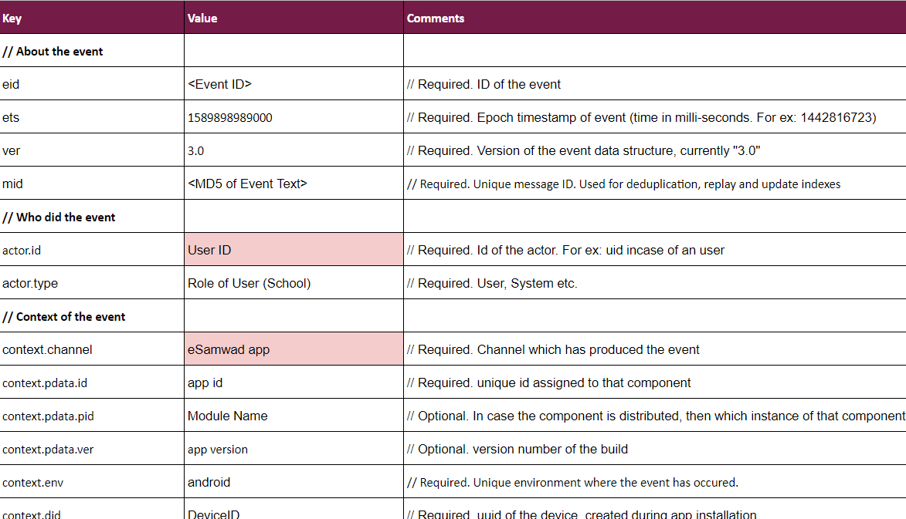
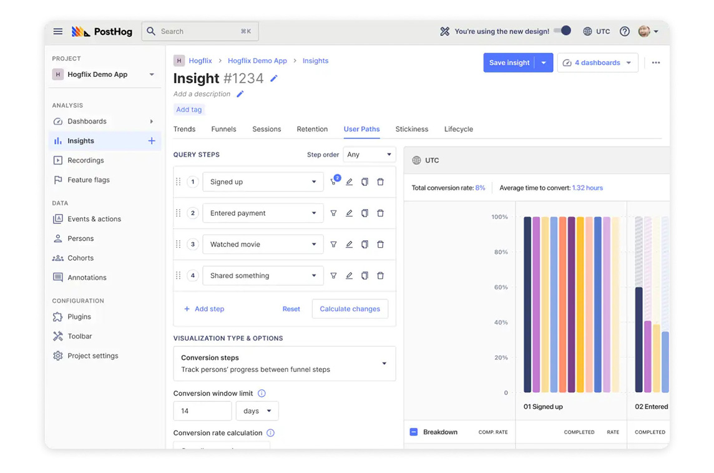

---
type: landing
directory: developer-docs/telemetry
title: Telemetry
page_title: Telemetry
description: Telemetry Overview
published: true
allowSearch: true
--- 
## Overview 

Telemetry is an user behavior analytics tool that helps you understand how different users interact with your application. To start using Telemetry, you just need to configure the telemetry code in your application front-end. After the code is set up, Telemetry will start capturing and analyzing the user activity on your application.

Telemetry keeps track of the user data by capturing “Events” performed by the user. These events can be anything such as clicking on a button, mouse movements, searches, sharing links, how much time they spend on your application etc. 

Telemetry can help organizations optimize the way visitors use their applications and help retain visitors on these applications. It can help organizations build effective and user friendly applications.

## Why we need Telemetry?

The objective of telemetry is to assist in product, application or service development, modification or security. It works as a framework. Telemetry enables automatic collection of data from real-world, real-time use.

Typically, there are four levels of telemetry:

* Security

* Basic

* Enhanced

* Full

The level of data collected is a discrete decision of an organization or business. Analysis of this data offers insights into product and user behaviour and usage patterns, driving business decisions and research outcomes. You can program your telemetry analytics to suit your requirements.

Sunbird’s telemetry service has Full level telemetry.

## Use cases of saving telemetry data

## 1. e-Samwad App

Listed in the following excel file are some of the use cases where Telemetry was used to capture user data for the e-Samwad android app. To view it, click [here](https://docs.google.com/spreadsheets/d/1HvryrR95cHRshST3Zg7AsWW4LXQ0h2G2j-3KmaFdcBE/edit#gid=0)

   ### Why do we want to Capture data?
   
   When a website or an application starts receiving traffic on their portals, it becomes important to track how all those users are interacting with your application. The data of how these users interact with your application front-end can then be used to improve the overall quality of the organization application. By analyzing this data, organizations can make their application user friendly and remove any roadblock they might face while surfing your application. 

   ### What data do we want to capture
   Essentially, we want to capture every action a visitor makes on your portal from the moment he visits it and to the time he leaves. These actions can be anything such as:

   - Clicking on a button
   - Total time spent
   - User interactions such as search, zoom, preview, resize etc, 
   - User responses on polls, questions etc.
   - Interrupts triggered during user activity for eg, mobile app sent to background, call on the mobile etc.
   - Capture what content the user is sharing from your portal. For eg, link, file, telemetry data etc.
   - Data related to user feedback

  ### How are we capturing this Data?
  
  In order to configure Telemetry to capture the user data on your application, we first have to integrate a telemetry code sample onto the front-end of your application.
  
  The integrated code will then start capturing all the “events” every user performs on the organization application. Everything from what a user clicks to how much time a user spends on various sections of the website will be captured and stored for analysis.

 Example for how we are capturing and saving the telemetry data for the e-Samwad android app:

<!--  -->

 

 ### How the Analytics is Done on Posthog 
 
 PostHog can be deployed on your own infrastructure and provides a large set of tools to help improve your product, such as session recording, heatmaps, and feature flags, that are unique to PostHog in the product analytics space. To integrate Posthog with your application backend and enable Analytics services, follow these [steps](https://posthog.com/docs/integrate).

 Following example shows a sample Posthog analytics dashboard: 

 

<!--  -->

## Specifications Followed by Telemetry Samagra:

Currently the Telemetry samagra follows some specifications for their events. These specifications state that all events follow a common data structure, though the event data structure (“edata”) may differ for each event.
Below listed are some of the event specifications. You can view all of them in more detail [here](http://docs.sunbird.org/latest/developer-docs/telemetry/specification/#events-specs). 

- Start - This method initializes capture of telemetric data associated to the start of user action
- Impression - This method is used to capture telemetry for user visits to a specific page.
- Interact - This method is used to capture user interactions on a page. For example, search, click, preview, move, resize, configure
- Feedback - This method is used to capture user feedback

## Posthog - Analytics Tool We Use for Telemetry

PostHog is an open-source product analytics suite, built for engineers that can automatically track every event on your website or app. Based on these events, it can help you understand your users and how to improve your product.

Posthog is used as an Analytic tool for Telemetry samagra.  PostHog is designed to give you every tool you need to understand user behavior, create hypothesis and release changes to make your product more successful. To know more about Posthog and how to set it up, check out their documentation [here](https://posthog.com/docs).

## Telemetry Basics

Some basic concepts related to Telemetry:

- [Event Specifications for Telemetry events](http://docs.sunbird.org/latest/developer-docs/telemetry/specification/#events-specs)
- [Sending Telemetry](http://docs.sunbird.org/latest/developer-docs/telemetry/sending_telemetry/)
- [Consuming Telemetry data](http://docs.sunbird.org/latest/developer-docs/telemetry/consuming_telemetry/)

