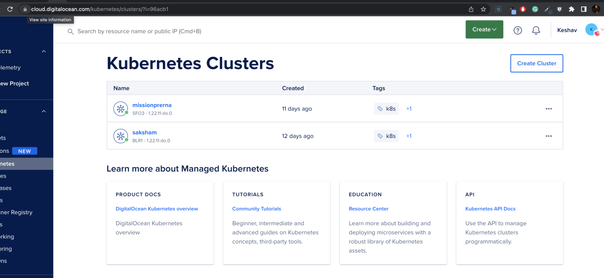
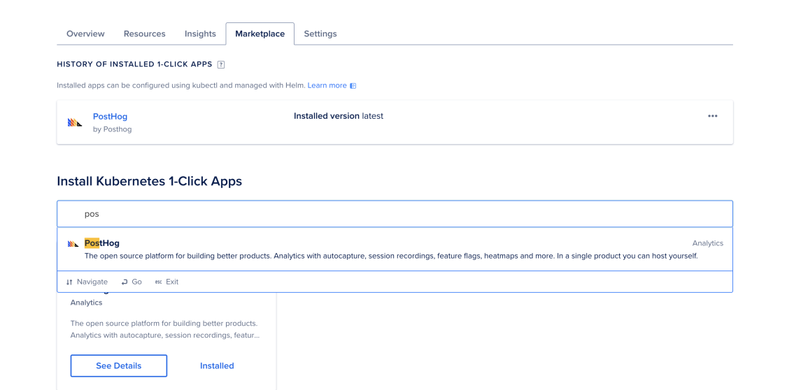

## Posthog for your application

### Prerequisites for setup on server

1. Posthog Account
2. A self-hosted PostHog instance (or a local development environment)
3. Some knowledge of JavaScript (or TypeScript)
4. Django
5. Prefferred OS - Linux

### Posthog self-setup instructions

Self hosting and running a production environment of Posthog is one of the most important steps to take as a developer. The following docs go through how to Self host an instance of Posthog and various deployment options it provides. To view all these steps, click [here](https://posthog.com/docs/self-host).

### Setting up environment variables for your application

In posthog, you can set the values through both Instance settings as well as Environment variables. Though Instance settings is recommended for most applications, you can also set the values for your application using Environment variables. There are various environment variables you can set for your application instance. To get a detailed explanation of what each variable does and how to configure it, click [here](https://posthog.com/docs/self-host/configure/environment-variables).

## Setting up Posthog on Digital Ocean:

First, we have to add the website DNS addresses to the Digital Ocean account. To do that, you just have to point the DNS nodes in the domain on the DigitalOcean dashboard, Digital ocean has some DNS points such as DNS1, DNS2, DNS3. You simply have to put your website DNS values into these textfields.

Follow these steps in order to [Set up DNS and Digital Ocean](https://docs.digitalocean.com/products/networking/dns/quickstart/). To verify the setup, click [here](https://dnschecker.org/)

1. Create a Kubernetes Cluster with at least 4 nodes. If you have a Digital Ocean account, just click [here](https://cloud.digitalocean.com/kubernetes/clusters/) to directly create a new cluster. Provide a name to the cluster. Optionally, you can provide some tags for your cluster as well.

The following image shows what a sample kubernetes cluster looks like:

<p align="middle">
 
</p>

2. Once you create a Cluster, click on the newly created cluster. Inside the cluster, Navigate to the "Marketplace" section. Under the "Install Kubernetes 1-Click Apps" search Posthog. The following drop down list should show Posthog, click on the option to download Posthog for your application cluster instance.

<p align="middle">
 
</p>

3. For the next step, you have to modify the "values.yml" file with your custom domain names.

```yaml
cloud: "do"
ingress:
  hostname: telemetry.shikshaplatform.io
  nginx:
    enabled: true
cert-manager:
  enabled: true
ingress-nginx:
  controller:
    config:
      use-proxy-protocol: true
    service:
      annotations:
        service.beta.kubernetes.io/do-loadbalancer-hostname: telemetry.shikshaplatform.io
        service.beta.kubernetes.io/do-loadbalancer-enable-proxy-protocol: "true"
```

In both Line 3 and Line 15, the values "hostname" and "service.beta.kubernetes.io/do-loadbalancer-hostname" are updated to include the organization domain names.
